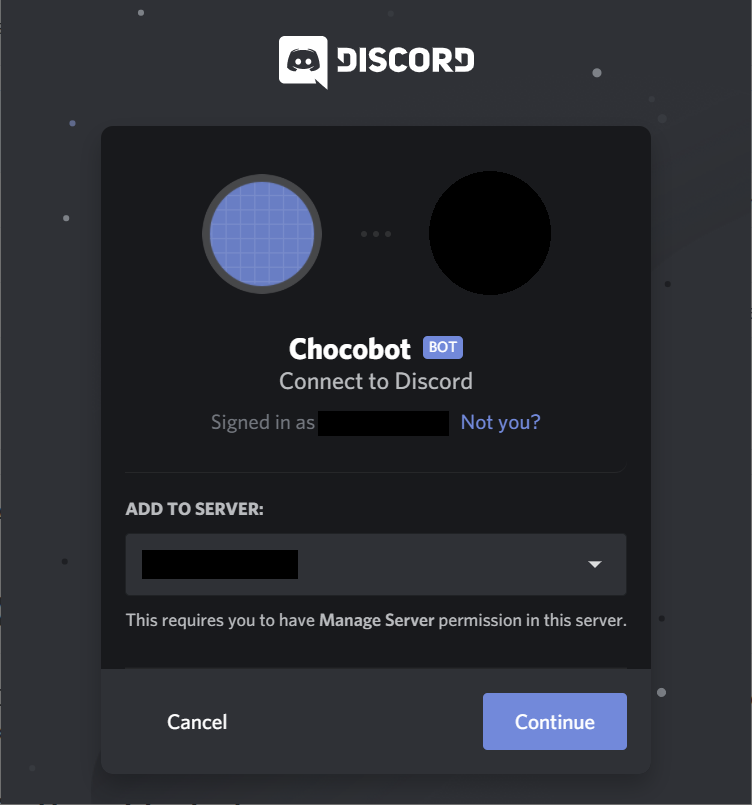
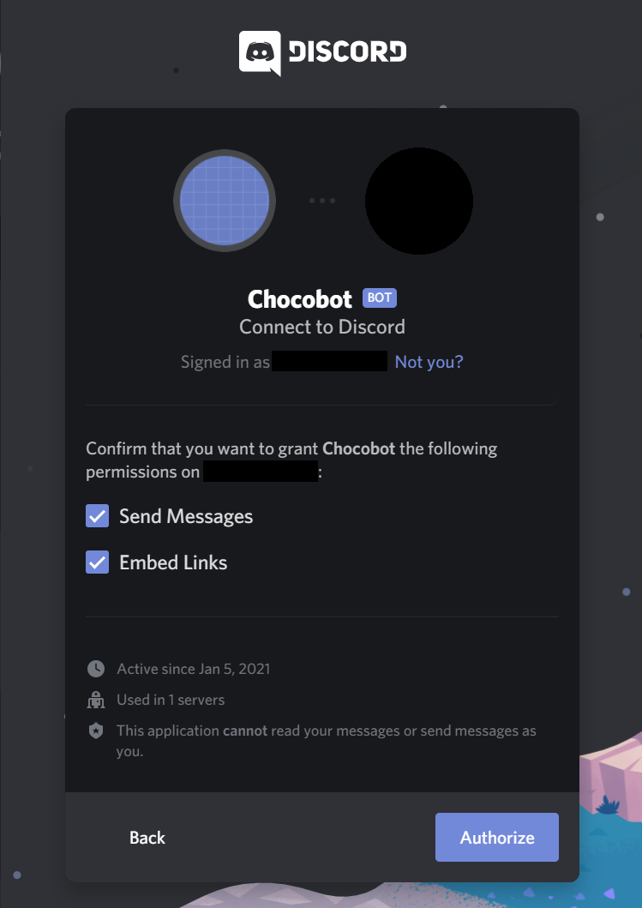
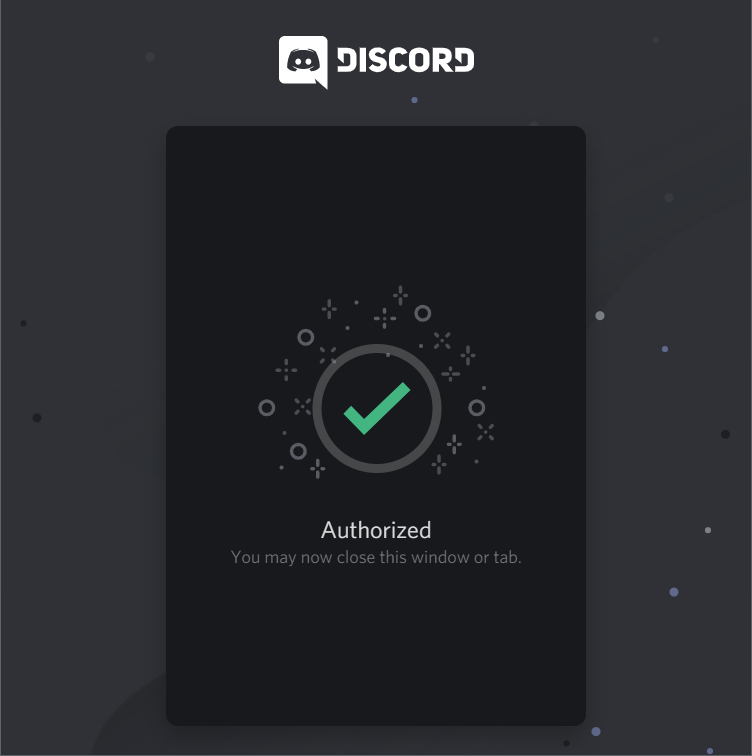
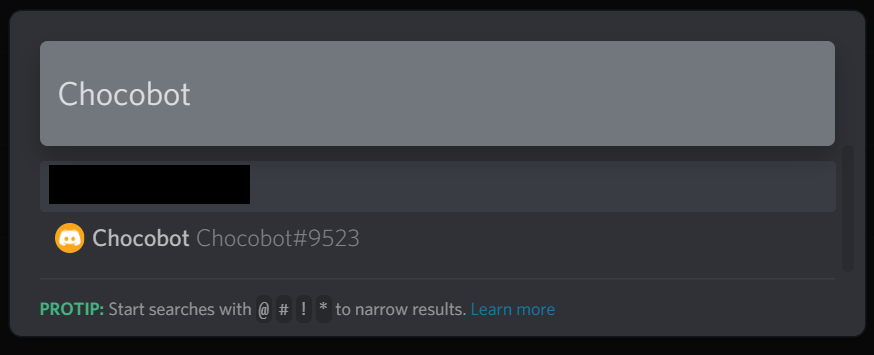
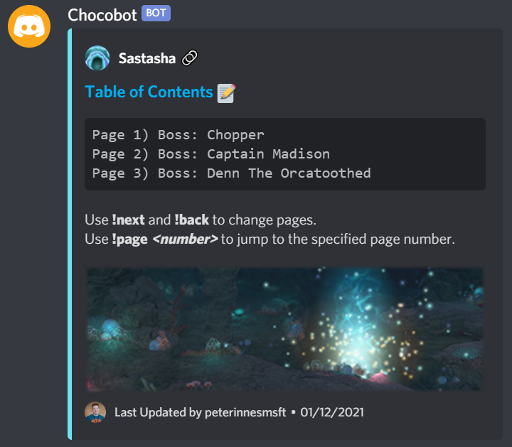
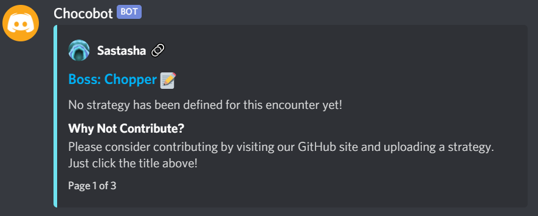
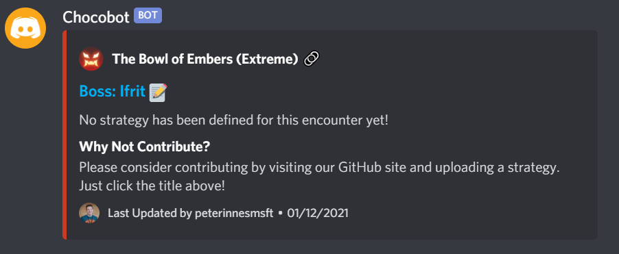
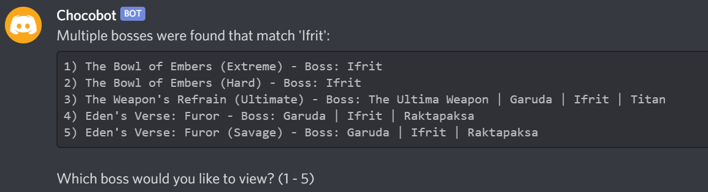

# Chocobot

Chocobot is a bot application for Discord that provides succinct strategies for duties and bosses in FINAL FANTASY XIV.

## Getting Started

### Installing Chocobot

To add Chocobot to your Discord server, simply perform the following steps:

1. Click [here](https://discord.com/api/oauth2/authorize?client_id=796117085637181460&permissions=18432&scope=bot) to begin the authorization process.

2. Select which Discord server you would like to add Chocobot to:



3. Select which permissions to grant to Chocobot:



4. Verify that Chocobot is successfully authorized:



Once Chocobot has been successfully authorized, you are ready to start using it in Discord!

### Start a Conversation

Once Chocobot has been added to your Discord server, you can interact with it by sending it a direct message:

1. On the Discord application, select the Home tab, then click the 'Find or start a conversation' text box:


2. In the pop-up that appears, search for Chocobot:



You can confirm the username by navigating to your server settings and viewing the Server Members. Once you have confirmed, click the user to start a conversation.

## Using Chocobot

Chocobot is designed to provide strategy information for duties (Dungeons, Trials, Raids and Ultimate Raids), as well as individual bosses. As such, there are two commands designed to help look up this information:

- The **!duty** command presents strategy information for an entire duty, including all bosses within that duty.
- The **!boss** command presents strategy information solely for a single boss.

### !duty Command

To search for duty strategy information, use the following command:

> !duty *search*

- ***search*** : The search term to use for locating the corresponding duty. This can be an exact name match, a partial match, or even abbreviations, e.g:

```
!duty Sastasha
!duty matoya
!duty tamtara hard
!duty e9s
```

If Chocobot is able to successfully find one or more matching duties based on the specified search term, it will load up the strategy information for the duty that closest matches the term.

On loading the strategy information for a duty, Chocobot will show both the Table of Contents for that duty, as well as the first page of information:




You can navigate through all of the duty's pages by using any of the following commands:

- **!next** will display the next page of information for the current duty.
- **!back** will display the previous page of information for the current duty.
- **!page** will jump to the specified page number for the current duty.

Additionally:

- If the duty name (e.g. 'Sastasha') has a 🔗 icon next to it, you can click it in supported Discord clients to go to the duty information on The Lodestone.
- If the page title (e.g. 'Boss: Chopper') has a :pencil: icon next to it, you can click it to go to the corresponding document in GitHub for that duty.

### !boss Command

To search for boss strategy information, use the following command:

> !boss *boss name*

- ***boss name***: The name of the boss to search for. This can either be an exact or partial match, e.g.:

```
!boss Ifrit
!boss zenos
!boss porxie
```

If Chocobot is able to successfully find a matching boss based on the specified name, it will load up the strategy information for the boss:



If more than one boss is located that matches the specified name, a list of all matching results will be displayed:



To select a particular boss, simply reply to Chocobot with the number that matches the desired option. If no response is received within a short time limit, Chocobot will cancel the command and take no further action.

## Contributing to Chocobot